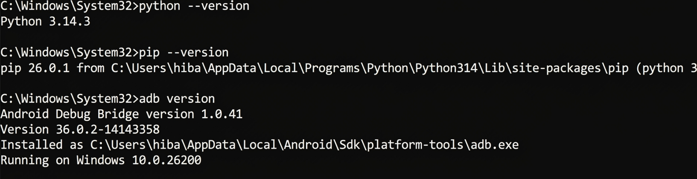
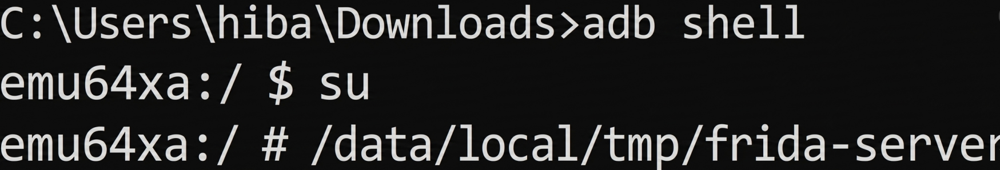
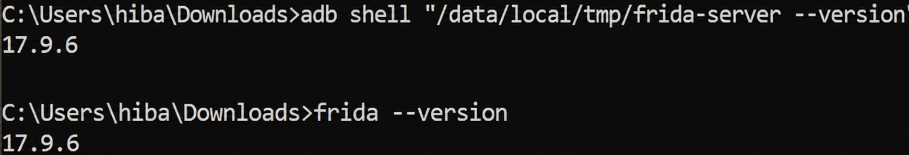
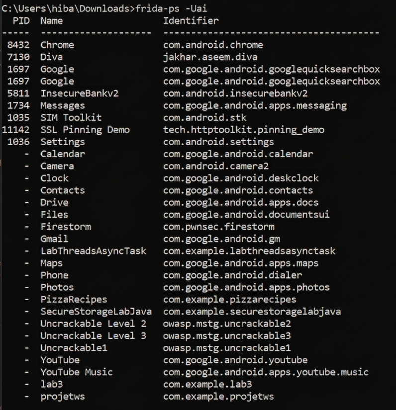
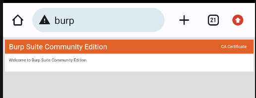
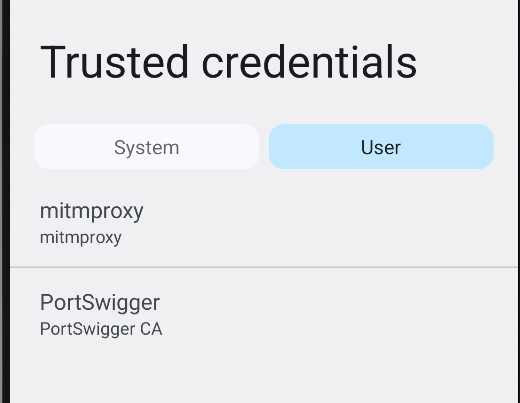
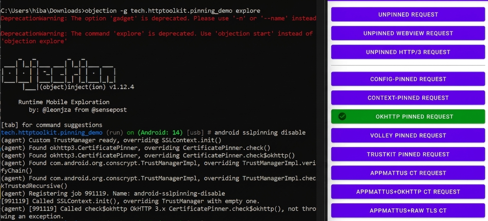
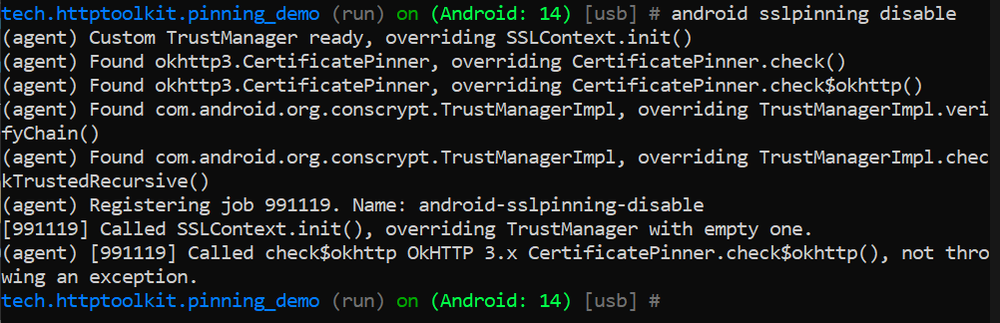

# Inspection HTTPS Android : Désactivation du SSL Pinning avec Objection + Proxy (Burp/mitmproxy)

Ce laboratoire documente la procédure technique pour intercepter le trafic HTTPS d'une application Android protégée par SSL Pinning en utilisant l'outil **Objection** (basé sur Frida).

## 1. Préparation de l'Environnement

La première étape consiste à vérifier que les outils de base sont installés et fonctionnels sur le système hôte.

*Figure 1 : Vérification des versions de Python (3.14.3), Pip (26.0.1) et ADB (1.0.41).*

Ensuite, nous installons ou mettons à jour les composants nécessaires à l'exploitation :
- **Frida** et **Frida-tools**
- **Objection**

## 2. Configuration de l'Appareil Android

Le serveur Frida doit être déployé et exécuté sur l'appareil cible (ou émulateur) avec les privilèges root.

*Figure 3 : Exécution du binaire frida-server dans /data/local/tmp/ via un shell root.*

Il est impératif que la version du serveur sur l'appareil corresponde exactement à celle installée sur le PC pour éviter tout conflit de communication.

*Figure 4 : Confirmation de l'alignement des versions (17.9.6).*

## 3. Identification de l'Application Cible

Grâce à `frida-ps`, nous listons les applications installées pour récupérer le nom de package exact de notre cible.

*Figure 5 : Identification de l'application "SSL Pinning Demo" (`tech.httptoolkit.pinning_demo`).*

## 4. Configuration du Proxy et du Certificat CA

Pour que Burp Suite puisse déchiffrer le flux HTTPS, son certificat doit être installé manuellement sur le terminal Android comme autorité de confiance utilisateur.

*Figure 6 : Accès à l'interface de téléchargement du certificat PortSwigger.*

*Figure 7 : Validation de l'installation du certificat PortSwigger dans les identifiants de confiance.*

## 5. Exécution du Bypass SSL Pinning

Nous lançons l'application via Objection pour injecter les hooks de désactivation du pinning en temps réel.

*Figure 8 : Lancement d'Objection et exécution de la commande `android sslpinning disable`.*

L'outil identifie automatiquement les bibliothèques réseau (comme OkHttp) et neutralise les vérifications de certificats.

*Figure 9 : Vue détaillée des hooks Frida interceptant les méthodes de vérification de TrustManager et CertificatePinner.*

## 6. Validation de l'Interception

Une fois le bypass actif, les requêtes qui étaient auparavant bloquées ou épinglées sont désormais visibles en clair dans Burp Suite.

*Figure 10 : Requête HTTPS interceptée avec succès (Status 200 OK) montrant le contenu de la réponse.*

L'application (à droite sur la Figure 8) confirme également la réussite de la requête avec un indicateur visuel vert.
